# How to use our plugins to write code in MPS

## index

1. Install plugins in MPS
2. Some initialization before using plugin in a new project
3. An example of using our plugin to write code in MPS

## Install plugin in MPS

### for mac os
1. open MPS
2. click `MPS`——>`Preference` on the upper-left corner
3. select `Plugins` in the popup
4. click `Install plugin from disk` on the lower-right corner
5. select `JavaPoiExtention.zip` in the popup
6. click `Restart Jetbrains MPS`，the plugin will be available after the restart

### for windows

1. open MPS
2. click `File`——>`Settings` on the upper-left corner
3. select `Plugins` in the popup
4. click the gear on the upper-right corner, select `Install Plugin from Disk` in the popup
5. select `JavaPoiExtention.zip` in the popup
6. click `Restart IDE`，the plugin will be available after the restart

## Some initialization before using plugin in a new project

1. open MPS

2. click `Create New Project`

3. select `Solution Project` on the left hand，fill in `Project Name` and `Solution Name` on the right hand，click`OK`

4. create a new model in the solution

    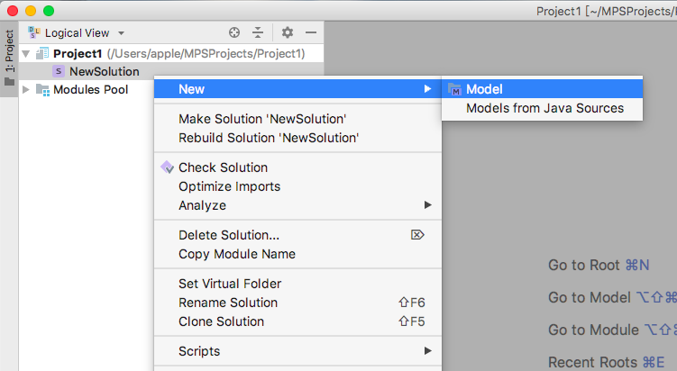

5. fill in the name of the model, click `OK`

    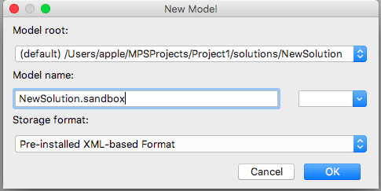

6. set the `dependencies` and `used languwages` of the model in the popup (here we use JavaPpoiExtension as an example. for the `dependencies` and `used languwages` of other plugin, please go to the corresponding plugin folder and read the plugin-specific manual)

7. add dependency `org.apache.poi.ss.usermodel`

    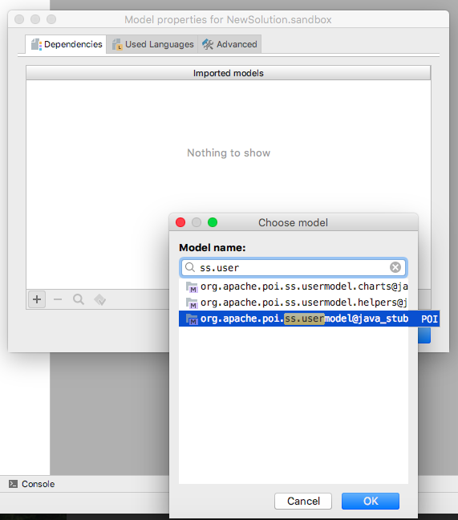

8. add dependency `org.apache.poi.hssf.usermodel`

    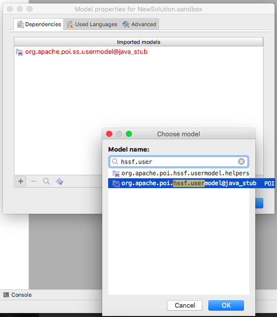

9. add languwage `POI`

    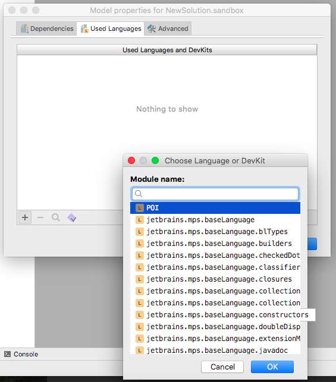

10. add languwage `jetbrains.mps.baselanguage`

    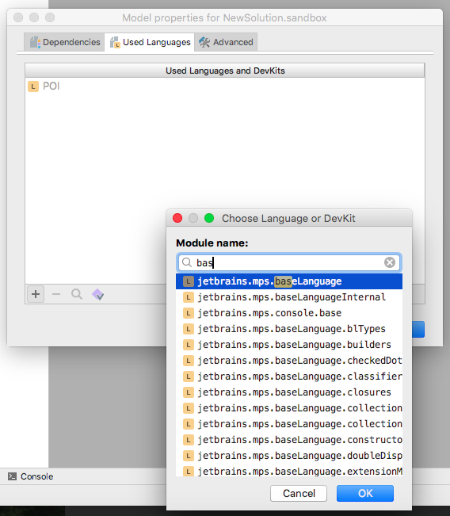

## An example of using our plugin to write code in MPS

Here we use JavaPpoiExtension as an example.

### Some keyboard shortcut

these shortcuts can be modified through `MPS`-->`Preference`-->`keymap`

1. `complete smart`：we use`alt`+`space`
2. `intentions`：list all intention functions，it can't be changed，we use `alt`+`enter`
3. `Expand Selection`：expand selection on the AST, we use `command`+`up`
4. `Shrink Selection`：shrink selection on the AST, we use `command`+`down`
5. `Select Previous`：select previous line, we use `shift`+`up`
6. `Select Next` ：select next line, we use `shift`+`down`
7. `copy & paste`：we use `ctrl`+`c`，`ctrl`+`v`

### An example

1. create a java class in the model

    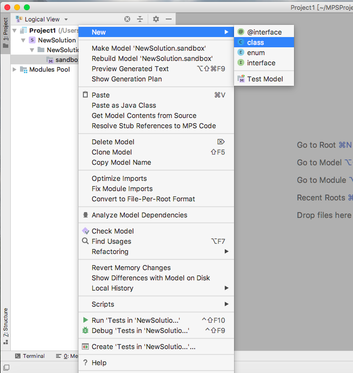

2. after filling in the class name and main function(psvm), type in `crea` and press `ctrl`+`space`, then pick `CreateNewHSSFWorkbook` to create a new workbook

    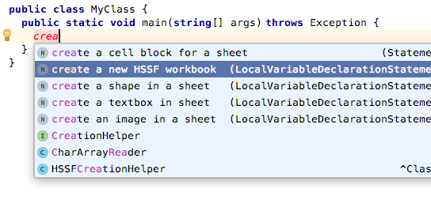

3. fill the empty cells(just like what we do in the previous step) 

    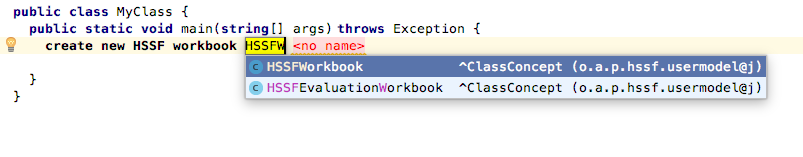

4. create a sheet in our workbook

    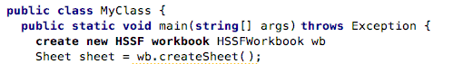

5. create some cells in our sheet

    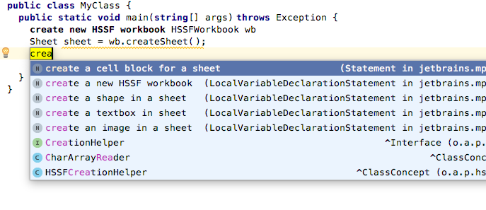

6. the range of the cell block is from (0,0) to (10,10)

    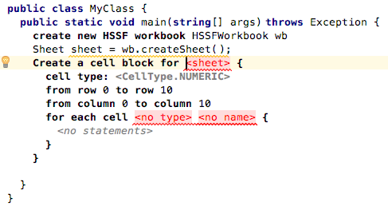

7. the cell type is `CellType.NUMERIC`，and set it's value to 2

    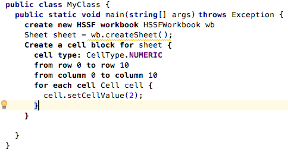

8. iterate a sheet, including it's empty rows and empty cells

    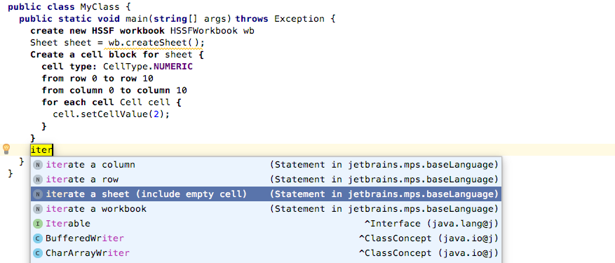

9. fill in some processing statements in corresponding block

    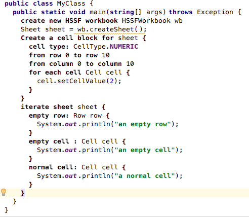

10. deal with each nonempty cell according to their types

    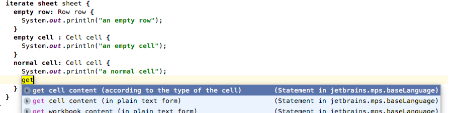

11. print cell content, if it's a `NUMERIC` cell, set it's value to 1

    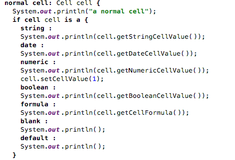

12. set cell color

    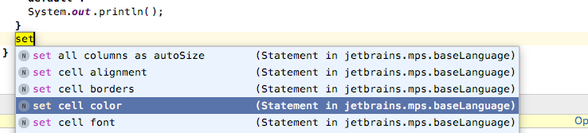

13. set foreground color to AQUA and background color to RED, and the fill pattern to BIG_SPOTS

    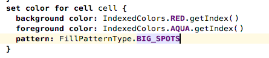

14. set cell font

    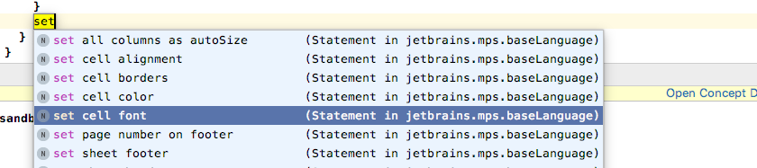

15. name it as `Courier New`，and set some properties

    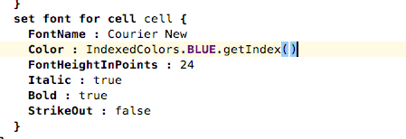

16. get the content of the workbook

    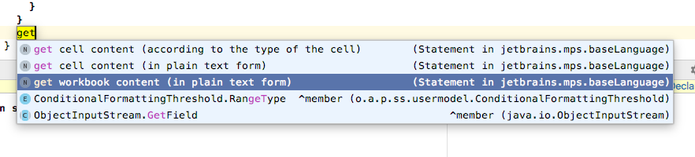

17. print the content of the workbook

    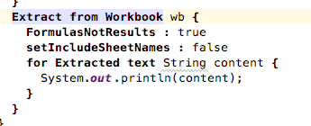

18. run the main function of the class

    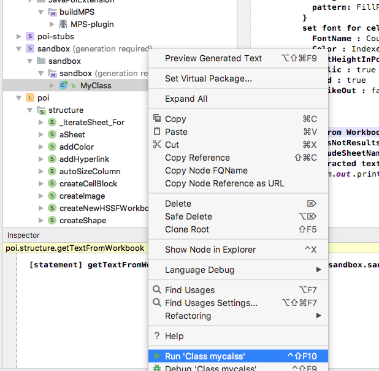

19. some outputs

    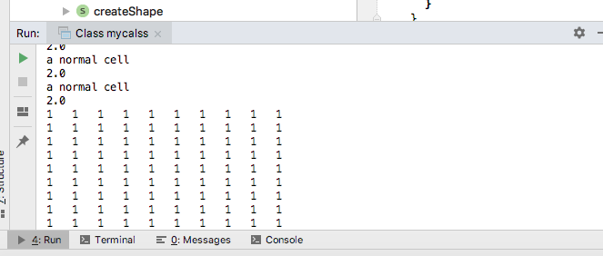

20. right click in the editor, select `Preview Generated Text`

    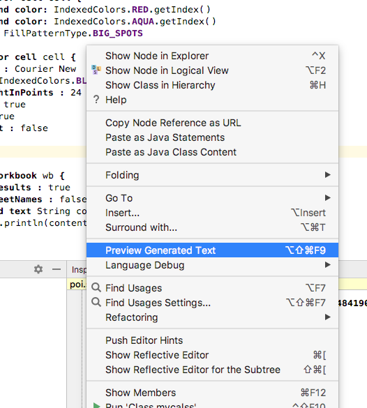

21. part of the automatically generated java code

    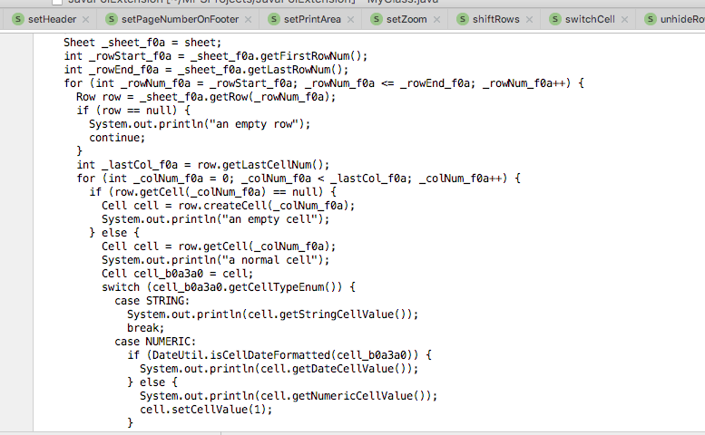
    
### how to set the working directory：

1. open `Run` menu，select `Edit Configurations`

    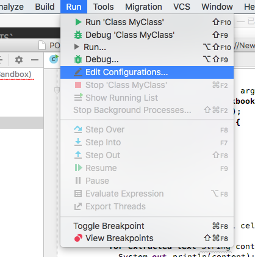
    
2. edit `Working directory`

    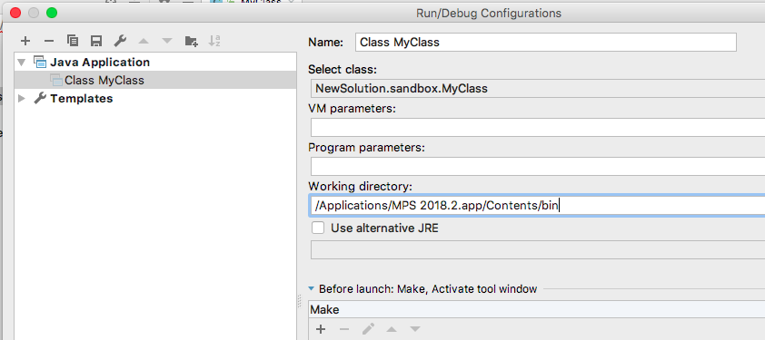
 

## This Complete the Tutorial
